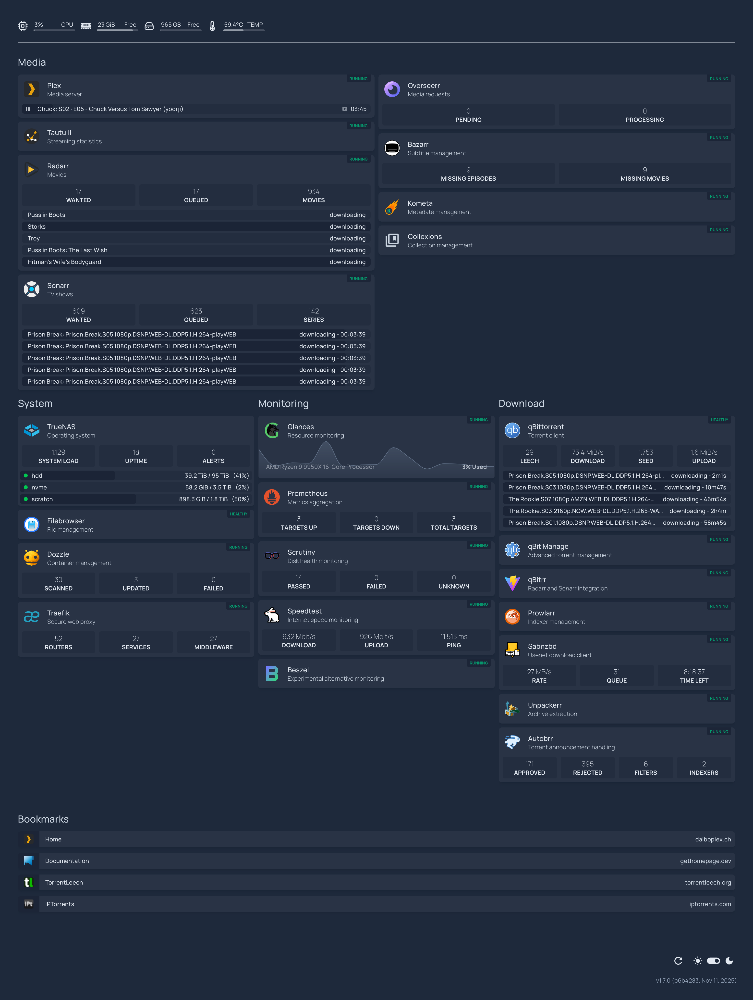
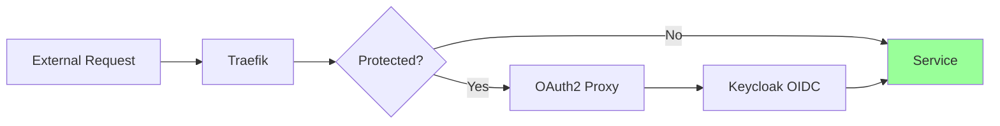
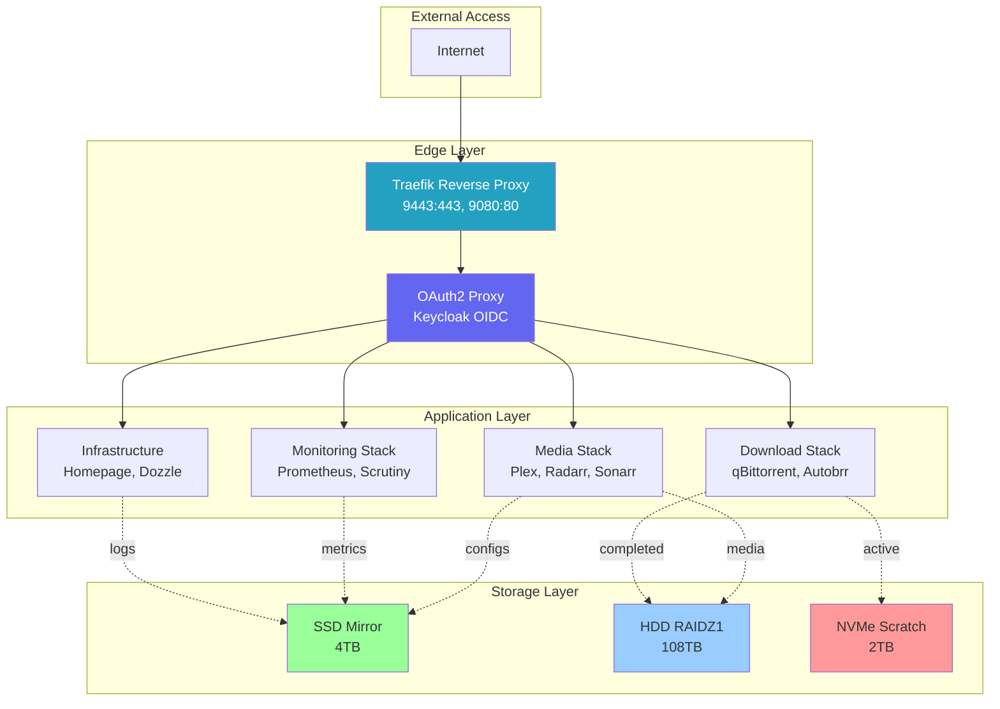

[](https://www.truenas.com/)
[](https://www.docker.com/)
[](https://traefik.io/)
[](apps/)
[]()

A comprehensive home media server and infrastructure setup running on TrueNAS, featuring automated media management, secure authentication, and enterprise-grade monitoring.


*Homepage dashboard showing all services and monitoring widgets*

## Table of Contents

- [Overview](#overview)
- [Hardware Specifications](#hardware-specifications)
- [Storage Architecture](#storage-architecture)
- [ZFS Configuration](#zfs-configuration)
- [Application Stack](#application-stack)
- [Network & Security](#network--security)
- [Architecture Diagrams](#architecture-diagrams)
- [Key Features](#key-features)

## Overview

Dalboplex is a production-quality home server infrastructure built on TrueNAS, providing:

- **Media Streaming**: Plex Media Server with GPU transcoding
- **Automated Media Management**: Radarr, Sonarr, and supporting tools
- **Secure Access**: OAuth2/OIDC authentication via Keycloak
- **SSL/TLS**: Automated Let's Encrypt wildcard certificates
- **Comprehensive Monitoring**: Prometheus, Scrutiny, Glances
- **High Performance**: Tiered storage with NVMe scratch, SSD configs, HDD media
- **Automated Updates**: Watchtower for container management

## Hardware Specifications
[Parts list](https://pcpartpicker.com/user/sadimusi/saved/8cJMTW)

### Core Components

| Component | Specification |
|-----------|---------------|
| **CPU** | AMD Ryzen 9 9950X (16C/32T @ 4.3GHz) |
| **RAM** | 192GB DDR5-5600 (4x 48GB Corsair Vengeance) |
| **Motherboard** | ASRock X870E Taichi (AM5, ECC-capable) |
| **HBA** | Broadcom LSI 9305-16i (16-port SAS3) |
| **PSU** | Seasonic Prime TX-1000 (1000W, 80+ Titanium) |
| **Case** | Fractal Design Define 7 XL |
| **Cooling** | Arctic Liquid Freezer III Pro 280mm AIO |
| **GPU** | Intel Arc A380 |

### Storage Devices

| Pool | Devices                    | Capacity | Purpose |
|------|----------------------------|----------|---------|
| **Boot** | 1x Samsung 9100 Pro 1TB NVMe | 1TB | TrueNAS OS, Docker images |
| **Scratch** | 1x Samsung 990 Pro 2TB NVMe | 2TB | Temporary downloads |
| **Apps** | 2x WD_BLACK SN8100 4TB NVMe | 4TB usable | App configs, databases |
| **Media** | 8x WD Gold 18TB HDD        | ~108TB usable | Media library, completed torrents |
| **Media Metadata** | 2x WD Red SA500 4TB SATA   | Special vdev | Metadata acceleration for Media pool |

**Future Expansion**: Media pool can expand to 16 drives (4x 4-drive RAIDZ1 vdevs, ~216TB usable)

## Storage Architecture

### Storage Layout

```
/mnt/nvme/apps/          → App configs & databases (NVMe SSD Mirror)
├── <container>/
│   ├── config/          → Application configuration
│   ├── data/            → Application databases & state
│   └── logs/            → Application logs

/mnt/hdd/media/          → Media library (HDD RAIDZ1)
├── movies/              → Radarr-managed movies
├── tv/                  → Sonarr-managed TV shows
└── downloads/           → Completed torrents

/mnt/scratch/downloads/  → Active torrent downloads (NVMe Scratch)
```

### Download Workflow

1. **Download Initiation** → Active downloads to `/mnt/scratch/downloads` (NVMe)
2. **Completion** → Move to `/mnt/hdd/media/downloads` (HDD)
3. **Import** → Hard link to `/mnt/hdd/media/movies` or `/mnt/hdd/media/tv`
4. **Seeding** → Continue from HDD location

## ZFS Configuration

### Pool Settings

| Pool | RAID Level | Record Size | Compression | Atime | Special Features |
|------|-----------|-------------|-------------|-------|------------------|
| Boot | None | Default     | lz4 | off | -                |
| Scratch | None | 128K        | lz4 | off | -                |
| Apps | Mirror (RAID1) | 128K        | lz4 | off | Monthly scrubs    |
| Media | RAIDZ1 | 1M          | lz4 | off | Monthly scrubs    |

### Redundancy Strategy

- **Boot Pool**: No redundancy (OS is replaceable)
- **Scratch Pool**: No redundancy (ephemeral data)
- **Apps Pool**: Mirrored (1-drive fault tolerance for critical data)
- **Media Pool**: RAIDZ1 (1-drive fault tolerance, expandable to 4x RAIDZ1 vdevs)

## Application Stack

### Media Management (Primary)

**Compose files**: [plex.yml](apps/plex.yml), [media.yml](apps/media.yml)

| Application | Subdomain | Purpose |
|-------------|-----------|---------|
| [](https://www.plex.tv/) | [plex.dalboplex.ch](https://plex.dalboplex.ch) | Media server |
| [](https://tautulli.com/) | [stats.dalboplex.ch](https://stats.dalboplex.ch) | Plex statistics |
| [](https://radarr.video/) | [movies.dalboplex.ch](https://movies.dalboplex.ch) | Movie manager |
| [](https://sonarr.tv/) | [tv.dalboplex.ch](https://tv.dalboplex.ch) | TV show manager |

### Media Management (Secondary)

**Compose file**: [media.yml](apps/media.yml)

| Application | Subdomain | Purpose |
|-------------|-----------|---------|
| [](https://overseerr.dev/) | [requests.dalboplex.ch](https://requests.dalboplex.ch) | Media request portal |
| [](https://www.bazarr.media/) | [subtitles.dalboplex.ch](https://subtitles.dalboplex.ch) | Subtitle manager |
| [](https://prowlarr.com/) | [indexers.dalboplex.ch](https://indexers.dalboplex.ch) | Indexer manager |
| [](https://kometa.wiki/) | - | Metadata manager |
| [](https://recyclarr.dev/) | - | Quality profiles |
| [](https://github.com/Woahai321/list-sync) | [collexions.dalboplex.ch](https://collexions.dalboplex.ch) | Collection manager |
| [](https://github.com/RemiRigal/Plex-Auto-Languages) | - | Language track automation |
| [](https://plexguide.github.io/Huntarr.io/) | [huntarr.dalboplex.ch](https://huntarr.dalboplex.ch) | Missing content hunter |
| [](https://github.com/Cleanuparr/Cleanuparr) | [cleanuparr.dalboplex.ch](https://cleanuparr.dalboplex.ch) | Download cleanup |

### Download Clients

**Compose file**: [download.yml](apps/download.yml)

| Application | Subdomain | Purpose |
|-------------|-----------|---------|
| [](https://www.qbittorrent.org/) | [torrents.dalboplex.ch](https://torrents.dalboplex.ch) | BitTorrent client |
| [](https://sabnzbd.org/) | [usenet.dalboplex.ch](https://usenet.dalboplex.ch) | Usenet client |

### Download Automation

**Compose file**: [download-utils.yml](apps/download-utils.yml)

| Application | Subdomain | Purpose |
|-------------|-----------|---------|
| [](https://github.com/StuffAnThings/qbit_manage) | [qbit-manage.dalboplex.ch](https://qbit-manage.dalboplex.ch) | Torrent management |
| [](https://github.com/Unpackerr/unpackerr) | - | Archive extraction |
| [](https://autobrr.com/) | [autobrr.dalboplex.ch](https://autobrr.dalboplex.ch) | Torrent announcements |
| [](https://github.com/cross-seed/cross-seed) | - | Cross-seeding |
| [](https://github.com/buroa/qbrr) | - | Reannounce & categories |
| [](https://github.com/heapoutofspace/trackarr) | - | Tracker metrics exporter |

### Web Infrastructure

**Compose files**: [web.yml](apps/web.yml), [core.yml](apps/core.yml)

| Application | Subdomain | Purpose |
|-------------|-----------|---------|
| [](https://traefik.io/) | [traefik.dalboplex.ch](https://traefik.dalboplex.ch) | Reverse proxy |
| [](https://oauth2-proxy.github.io/oauth2-proxy/) | [login.dalboplex.ch](https://login.dalboplex.ch) | Auth proxy |
| [](https://gethomepage.dev/) | [admin.dalboplex.ch](https://admin.dalboplex.ch) | Admin dashboard |
| [](https://gethomepage.dev/) | [dalboplex.ch](https://dalboplex.ch) | Public dashboard |
| [](https://containrrr.dev/watchtower/) | - | Auto-updater |
| [](https://dozzle.dev/) | [docker.dalboplex.ch](https://docker.dalboplex.ch) | Log viewer |
| [](https://github.com/gtsteffaniak/filebrowser) | [files.dalboplex.ch](https://files.dalboplex.ch) | File manager |
| [](https://github.com/Tecnativa/docker-socket-proxy) | - | Socket proxy |

### Applications

**Compose file**: [owlmend.yml](apps/owlmend.yml)

| Application | Subdomain | Purpose |
|-------------|-----------|---------|
| [](https://github.com/heapoutofspace/owlmend) | [owlmend.dalboplex.ch](https://owlmend.dalboplex.ch) | Owlmend application |
| [](https://www.mongodb.com/) | - | Database |
| [](https://github.com/mongo-express/mongo-express) | [mongo.dalboplex.ch](https://mongo.dalboplex.ch) | MongoDB admin UI |

### Game Servers

**Compose file**: [games.yml](apps/games.yml)

| Application | Ports | Purpose |
|-------------|-------|---------|
| [](https://www.minecraft.net/) | 25565 | Minecraft Java server |
| [](https://github.com/wolveix/satisfactory-server) | 7777 | Satisfactory dedicated server |

### Monitoring & Metrics

**Compose file**: [monitoring.yml](apps/monitoring.yml)

| Application | Subdomain | Purpose |
|-------------|-----------|---------|
| [](https://github.com/louislam/uptime-kuma) | [uptime.dalboplex.ch](https://uptime.dalboplex.ch) | Service availability & alerts |
| [](https://grafana.com/) | [grafana.dalboplex.ch](https://grafana.dalboplex.ch) | Metrics visualization |
| [](https://prometheus.io/) | [prometheus.dalboplex.ch](https://prometheus.dalboplex.ch) | Metrics collection |
| [](https://github.com/nicolargo/glances) | [glances.dalboplex.ch](https://glances.dalboplex.ch) | System monitoring |
| [](https://github.com/AnalogJ/scrutiny) | [disks.dalboplex.ch](https://disks.dalboplex.ch) | Disk health |
| [](https://github.com/henrywhitaker3/Speedtest-Tracker) | [speedtest.dalboplex.ch](https://speedtest.dalboplex.ch) | Speed monitoring |

**Total Services**: 44 containers across 10 compose files

## Network & Security

### Domain Configuration

- **Primary**: `dalboplex.ch` - Main domain with wildcard SSL
- **Alias**: `dplx.ch` - Short alias (redirects to dalboplex.ch)

### Authentication Architecture



- **Provider**: Keycloak (external at `login.ceilingcat.ch`)
- **Protocol**: OAuth2/OIDC
- **Access Control**: Group-based (`dalboplex` group required)
- **Session**: 24-hour cookie on `.dalboplex.ch`
- **Public Routes**: Plex, Overseerr, public homepage

### Network Configuration

- **Docker Network**: `apps` (external, shared)
- **Container User**: `1000:1000` (PUID/PGID)
- **Timezone**: `Europe/Zurich`
- **Internal DNS**: Service name resolution

## Architecture Diagrams

### System Overview



## Key Features

### Performance Optimizations

- **GPU Transcoding**: Plex uses Intel Arc A380 via `/dev/dri`
- **Tmpfs Transcode**: 16GB RAM disk for Plex transcoding
- **Tiered Storage**: NVMe for active downloads, SSD for configs, HDD for media
- **ZFS ARC**: 192GB RAM provides massive cache benefit
- **Metadata vdev**: SSD mirror accelerates HDD pool metadata operations
- **Resource Limits**: qBittorrent capped at 16GB RAM

### Automation

- **Container Updates**: Watchtower runs daily at 05:00
- **Metadata Management**: Kometa runs daily at 04:00
- **Quality Profiles**: Recyclarr manages custom formats and quality settings
- **Archive Extraction**: Unpackerr handles RAR/ZIP automatically
- **Cross-seeding**: Automatic torrent discovery

### Monitoring & Observability

- **Service Availability**: Uptime Kuma tracks uptime and sends alerts with automatic monitor creation
- **Metrics Visualization**: Grafana dashboards for Prometheus data
- **Metrics Collection**: Prometheus with 90-day retention
- **System Monitoring**: Glances provides real-time system metrics
- **Disk Health**: Scrutiny monitors all storage devices (SMART)
- **Internet Performance**: Speedtest every 2 hours
- **Log Aggregation**: Dozzle for centralized log viewing

### Backup & Redundancy

- **Critical Data**: SATA SSD mirror for app configs/databases
- **ZFS Snapshots**: Automated snapshots on critical pools
- **Media Redundancy**: RAIDZ1 provides 1-drive fault tolerance per vdev
- **Config Version Control**: Git repository for compose files

---

**For installation and management instructions**, see [USAGE.md](docs/USAGE.md)

---

**Built with**: TrueNAS Scale, Docker, Traefik, Plex, and 30+ other amazing open-source projects.
